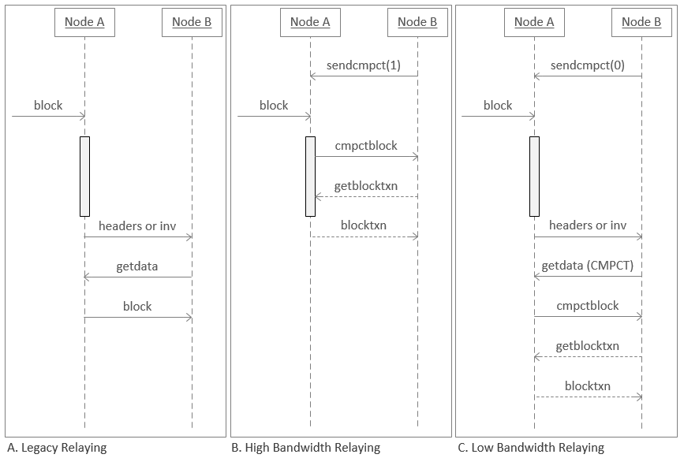

## Week 1: Origins of Bitcoin & the SegWit Upgrade

Last week I had the privilege of embarking on a 12 week fellowship which is meant to prepare me for contributing to Bitcoin open-source software development. The program is put on by BTrust. Each week we are given tasks to complete, and as part of the first month, we are assigned weekly learning modules to read. I am required as one of my tasks to write a technical article.  I decided to write more of a summary article of what I gathered from all the study materials instead of picking one individual topic to expand on. These were some of the things I learned about or found intriguing from the study material:

Week one’s study material gave me a trip down Bitcoin memory lane. It has been at least a year or more since I last read the [Bitcoin Whitepaper](https://chaincode.com/bitcoin.pdf) and I never felt like I fully grasped its contents, but this time was different. Especially after reading the complimentary materials from module one, which detailed the proof of work required to create Bitcoin. One thing that stood out to me from the whitepaper was the idea that the “only way to confirm the absence of a transaction is to be aware of all transactions,” which is made more difficult in the case of Bitcoin because it was designed to avoid the need for a trusted third party. Thus, the way Satoshi solved this problem was to publicly announce all transactions. Announcing all transactions solves part of the problem, but it’s also required that the history is agreed upon, meaning that the majority of network nodes need to come to consensus. The solution is effective in preventing double spends, but comes at the cost of some privacy. This is the main reason Satoshi mentions using “a new key pair … for each transaction to keep them from being linked to a common owner.”

Most people don’t take the time to appreciate the research and experimentation that predated Bitcoin’s existence. That is exactly what reading “[Bitcoin’s Academic Pedigree](https://queue.acm.org/doi/10.1145/3134434.3136559)” offers. Learning about the origins of digital signatures, time-stamping ledgers, merkle trees, and proof of work provided much needed context on how Bitcoin came to be. Something striking from the conclusion of the article was when the author stated, “Bitcoin was unusual and successful not because it was on the cutting edge of research on any of its components, but because it combined old ideas from many previously unrelated fields.” No matter our field of work or study, I think we can all learn something from old ideas, rather than always feeling the need to be original. The article almost makes me wonder if Satoshi stayed anonymous to shed light on the fact that the work was done for him, and he was just in the right place at the right time to put the puzzle pieces together. 

This is not to discount anything from Satoshi and his achievements though. Without his inventive instincts, who knows if Bitcoin would have ever come to fruition. I never previously knew about the years he was still actively developing the Bitcoin software as mentioned in “[The Incomplete History of Bitcoin Development](https://b10c.me/blog/004-the-incomplete-history-of-bitcoin-development/)”. It was fascinating to learn about his critical software changes like the introduction of checkpoints and safe mode that some might criticize as having given Satoshi authority over the system, but with Bitcoin in its infancy it seems there was no other option to avoid catastrophe. Bitcoin developers noted the possible threat that safe mode posed if in the wrong hands and after Satoshi left Bitcoin development, safe mode was scrapped. I looked further into checkpoints out of curiosity and found that as of Core v30, they were removed. Here is a link the the PR that shows the removal of checkpoints: https://github.com/bitcoin/bitcoin/pull/31649.

I really enjoyed returning to the basics with “[Security Models with John Newbery](https://btctranscripts.com/chaincode-residency/2019-06-17-john-newbery-security-models)” to better understand the different types of Bitcoin nodes and their tradeoffs. Full nodes download all headers and blocks and validate all blocks and transactions in the most-work blockchain. Whereas pruned nodes download and validate all blocks and headers similar to full nodes, but discard all block files over a certain storage limit. Finally, simplified payment verification (SPV) nodes offer the ability to run a node with limited resources that can still verify that a transaction has been confirmed by a certain amount of work and know what the most accumulated work chain is. The main tradeoffs for using a SPV node include their inability to determine whether a new block and its transactions are valid. They also can't enforce consensus rules and don’t give the same level of privacy when transacting.

As a full node runner, the discussion questions about why someone should run a full node that also accepts incoming transactions resonated with me. I have always advocated for running a full node without weighing the costs and benefits. Ultimately, it comes down to whether you want to support the network at the cost of additional resources. I had never thought of the block propagation and the transaction relay networks as separable until watching this video. It solidified my understanding of what a full node truly is. I now see a full node as having the entire blockchain synced and thus the node has the full history of transactions. Whether or not it relays unconfirmed transactions doesn’t bar it from being a full node.

Learning about SegWit opened my eyes to the innovation that it was. My only prior knowledge about SegWit was that using the addresses would save on transaction fees, but I never understood how. I now understand that the SegWit upgrade moves signature data out of the scriptSig field to a witness data field where the witness data is discounted. The fact that SegWit transactions have some of their content discounted results in the lower fees. 

Module two content like “[SegWit video w/ Jimmy Song](https://www.youtube.com/watch?v=Txfy2mFe16A)” and “[SegWit Benefits](https://bitcoincore.org/en/2016/01/26/segwit-benefits/)” described how the SegWit upgrade enabled layer two solutions like Lightning, which was a major improvement to Bitcoin. Previously, there were issues with data malleability that allowed bad actors to change the transaction identifier. This was not detrimental to Bitcoin because the signature data was still valid for changing ownership of the Bitcoin, but caused unreliability in the system. This is prevented by SegWit “by allowing Bitcoin users to move the malleable parts of the transaction into the transaction witness, and segregating that witness so that changes to the witness does not affect calculation of the txid.” An area of further exploration I am curious about is how txids are used by the Lightning protocol.

Another key improvement SegWit provides is script versioning. From my understanding this allows for easier upgrades to Bitcoin script. Previously developers were limited in their ability to upgrade it because the design only allowed “backwards-compatible (soft-forking) changes to be implemented by replacing one of the ten extra OP_NOP opcodes with a new opcode that can conditionally fail the script.” (Note: this is an area for further exploration for myself because I don’t fully understand what is meant by the quote) Segwit resolves this by including a version number for scripts, so that additional opcodes that would have required a hard-fork to be used in non-segwit transactions can instead be supported by simply increasing the script version.

These are only a few of the benefits SegWit offers and I feel there is still much more to learn about it. To further my knowledge and understand, I am interested in looking at the actual changes made to the Bitcoin Core project to implement it.

## Week 2: Mining & the P2P Network

Week two study materials expanded on areas of mining and block propagation that I had never previously thought about. The mining industry has reached a level of Application-Specific Integrated Circuit (ASIC) production and institutional mining that even Satoshi never imagined. The whitepaper mentions using CPUs to reward miners in proportion to the hash power they contribute to the network, but over the years miners incentivized by the rewards for mining a block have found ways to gain an advantage.

Due to the decentralized nature of Bitcoin, any time a new block is found, the mining pool that found it *usually* (a caveat here because there is something called selfish mining) announces it to the network and immediately starts mining the next block, but there is a period of time where all other miners are in the dark and still trying to find the previous block. This is mentioned in "[Bitcoin Whitepaper Errata and Details](https://gist.github.com/harding/dabea3d83c695e6b937bf090eddf2bb3)" as a response to Satoshi's whitepaper where it says, "As long as a majority of CPU power is controlled by nodes that are not cooperating to attack the network, they'll generate the longest chain and outpace attackers." It was previously identified that if a miner controls only 30% of the hash power, they are able to exploit the poor block propagation time to their advantage and control the network to some degree. I always took for granted my understanding of the 51% attack and never knew there were real issues with this paradigm. This was and still is a major concern for the network and requires continued attention and optimizations.

This phenomenon resulted in pool consolidation and high stale block rates effecting the profitability of miners and overall network health. In response, Matt Corallo created the Fast Relay Network (FRN) for miners to connect to in hopes it would help level the playing field and encourage decentralization of mining. This required a hub-and-spoke network topology, where the hub node would stream every transaction seen to those connected and when a block showed up all that was needed were short 2-byte ids to identify which transactions should be in the block. This was not an ideal long term fix and still didn't address the block propagation issues for nodes not connected to a FRN. 

BIP152 proposed compact blocks to help the main network improve block propagation time and bandwidth usage as discussed in "[Advances in Block Propagation w/ Greg Maxwell](https://btctranscripts.com/greg-maxwell/2017-11-27-gmaxwell-advances-in-block-propagation/)" and "[Compact Blocks FAQ](https://bitcoincore.org/en/2016/06/07/compact-blocks-faq/)." This was my first time hearing about this concept and honestly it fascinated me. Essentially, compact blocks are "sketches" sent between nodes that contain "the 80-byte header of the new block, shortened transaction identifiers, and some full transactions which the sending peer predicts the receiving peer doesn't have yet." From this sketch, the node attempts to reconstruct the block using the information received from the compact block and the transactions in their local mempool. If additional information is required the node will request it from its peer.

There are two modes of compact blocks, high and low bandwidth modes. An image of how block download and message flows differ between legacy relaying and the two modes of compact blocks can be seen below. When a node has high bandwidth mode enabled, it takes half or possibly one round trip if the node needs additional transactions. This drastically lowers the amount of bandwidth involved in block relay because the entire new block no longer needs to be relayed and downloaded. Lower block propagation time is a by product of compact blocks assuming the nodes share similar mempools. I won't detail much about the low bandwidth mode besides that it's beneficial for resource constrained nodes.

Image from "[Compact Blocks FAQ](https://bitcoincore.org/en/2016/06/07/compact-blocks-faq/)" detailing how compact block relay changed node messaging

To give some perspective on how impactful compact blocks are, Greg Maxwell mentions that about 12% of the bandwidth of a Bitcoin node accounts for block relay. Compact blocks lower this by 99%, thus the impact on a node's performance is an order of 99% of 12%.

Block propagation leads directly into the next area of study this week, which was the peer to peer network of bitcoin. Block propagation is one of the many things that Bitcoin nodes do. I already touched on the main types of Bitcoin nodes earlier in the article, and these nodes make up what we know as the decentralized Bitcoin network. John Newbery details the network as "an open, flat network with no authentication or special master nodes" in "[The Bitcoin P2P Network](https://btctranscripts.com/edgedevplusplus/2017/p2p-john-newbery/)."  

The more intricate and complex layer of the network is how these nodes communicate with one another. There are numerous different message types for different scenarios in the network. For example, when a new node turns on, it has no knowledge of the network, but is equipped with a few strategies to become connected to the network. "The first method is to query DNS using a number of "DNS seeds," which are DNS servers that provide a list of IP addresses of bitcoin nodes... The Bitcoin Core client contains the names of nine different DNS seeds." Alternatively, a node can use the command line argument -seednode to connect to another node using it as a seed. This initial connection is followed by what is called the inital handshake between peers where they share information with one another such as:

- nVersion - The bitcoin P2P protocol version the client "speaks" (e.g., 70002)
- nLocalServices - A list of local services supported by the node, currently just NODE_NETWORK
- nTime - The current time
- addrYou - The IP address of the remote node as seen from this node
- addrMe - The IP address of the local node, as discovered by the local node
- subver - A sub-version showing the type of software running on this node (e.g., `/Satoshi:0.9.2.1/`)
- BestHeight - The block height of this node’s blockchain
  
Once a full node is connected to the network and has established a few diverse connections, it begins the process of IBD. I was curious how the network handled the load of syncing a new node prior to reading about it so this peaked my interest. Basically, the version message (initial handshake) contains the BestHeight field, which is used to know how many blocks are still needed to be synced.

Since it has none, it starts by receiving an inv (inventory) message from its peers with the hashes of the first 500 blocks in the chain. It then requests blocks from its peers, spreading the load to ensure that it doesn't overwhelm any peer with requests. I also found it interesting that there is a MAX_BLOCKS_IN_TRANSIT_PER_PEER value tracked by the node to make sure that it only requests new ones as previous requests are fulfilled, allowing peers to control the pace of block sharing.

A synced full node then maintains that status by continuing to share messages as it receives them. In this way, full nodes are helping each other maintain the shared history of the blockchain. I believe I have a grasp on the high level communication between nodes, but I would like to explore inv messages further to examine the differences between block and transaction inventory messages and what is contained in them.

I had never fully considered the wide array of attack vectors in P2P networks. "[Attacking P2P of Bitcoin Core w/ Amiti Uttarwar](https://btctranscripts.com/la-bitdevs/2020-04-16-amiti-uttarwar-attacking-bitcoin-core)" provided much needed insights on the unique challenges P2P networks face. A major concern for decentralized P2P networks are eclipse attacks 

Cheers to week one and two of the fellowship! I look forward to sharing more technical content in the coming weeks.

