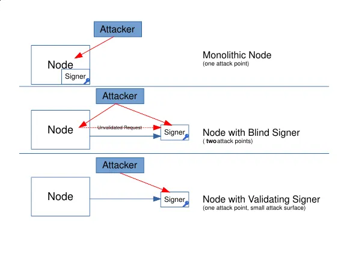
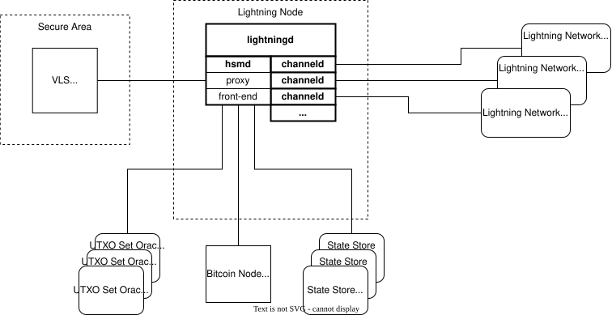

I am in the early stages of my learning about the Lightning Network and how it enables bitcoin transactions with improved privacy and instantaneous settlement that takes place off the base blockchain. Maybe it's just my perspective, but it seems that the complexities to run a Lightning node make the barrier to entry relatively high (especially for self custody). Also, the demand for 100% uptime to prevent losing channel states is unrealistic for most hobbyists.  

 The intention of Lightning and other layer two solutions are to offer frictionless payments and possibly open the door to a new less technical audience and different use cases, but I can't help but notice that many of the Lightning developers themselves admit to losing funds due to the numerous vulnerabilities the network faces. I appreciate the honesty and transparency, but this makes onboarding nontechnical users impossible because they won't understand why they lost their funds. This is also not to say that the bitcoin network is perfect by any means, and I think those with some understanding of bitcoin know that. All I am saying is that before worrying about performance optimizations for the lightning network and comparing how many transactions it can do per second versus Visa, we should make sure it's safe and reliable.

I fully accept that I am a novice in the bitcoin space and that my notions of the Lightning Network are not well tested. We all know how easy it can be to judge something from the sidelines without having any proof of work in the space. With that being said, while reading about the Lightning Network, I learned that the default behavior for node implementations is to act as "hot" wallets, where both your private Bitcoin funding keys and peer to peer identity keys are stored on the same internet connected device creating a central point of failure. This is a tradeoff to simplify node implementations and a major reason nobody should put their life savings on Lightning, but I know we can do better.

## Shortcomings of Blind Signing

There have been previous attempts to improve security on the Lightning network with one of those being the implementation of Blind Signers. This was meant to remove the central point of failure and thus protect private keys from being exposed on the internet connected Lightning node. Essentially, the keys for signing transactions was separated from the node associated with the identity on the Lightning network. However, one of the major issues with Blind Signers is they don't perform any validation. 

Imagine using a signing device for the base blockchain that signs transactions blindly. There are a lot of issues with this model. 

- What if the transaction has a timelock that locks the funds permanently? 
- What if the change address for any excess Bitcoin in the transaction is not yours?
- What if there is no change address and all excess Bitcoin is sent to the miners as fees? 
- What if a different input than you wanted to use was chosen for the transaction? 

The same goes for blindly signing transactions on the Lightning network. A Blind Signer is susceptible to numerous exploits, a few being:

- An input HTLC expires before the output does, and the output is claimed by the counterparty
- A Lightning user signs a revoked transaction, which allows the counterparty to take all funds
- A Lightning user pays an invoice more than once
- And many more that can be found [here](https://vls.tech/docs/v0.14.0/security/potential-exploits/)

Another issue with Blind Signers is that users must trust the node operator. "Blind signing wallets where nodes are run by a Lightning Service Provider (LSP), are not self-custodial because the LSP can unilaterally control the funds.[^1]" Yes, this implies that if a malicious actor were to gain control of the node they would have access to the user's funds. All that would be necessary is to provide the Blind Signer with a transaction that sends the funds to their wallet.

Finally, one of the biggest issues with the Blind Signer model is that there becomes two points of attack to access the wallet funds. An attacker could directly take your Blind Signer to access your funds or they could gain remote access of the node and communicate directly with the signer like previously mentioned. This offers worse security than the "Monolithic Node" (meaning everything is contained in the node) because funds can be lost if either the node or signer are compromised. Looking at the image below, you can get a better idea of this.

Image from "[Blind Signing Considered Harmful](https://medium.com/@devrandom/blind-signing-considered-harmful-ac82e5852853)" by devrandom depicting 3 distinct node architectures for the Lightning network

## There is a Better Way

In the image above, there is a third Lightning node architecture called Validating Lightning Signer ([VLS](https://vls.tech/)) This project is attempting to raise the bar for security on Lightning. Essentially, it's a library that supports self-custodial Lightning signers that separate your private keys from a Lightning node (like a Blind Signer) AND validates each signing request, ensuring only legitimate channel operations are approved. VLS immediately peaked my interest because of the security it offers Lightning users.

Self-custody is engrained in the ethos of Bitcoin because it offers a way to transact without relying on a third party. Satoshi put it plainly in the whitepaper by saying, "What is needed is an electronic payment system based on cryptographic proof instead of trust, allowing any two willing parties to transact directly with each other without the need for a trusted third party.[^2]" There is no reason why we shouldn't attempt to maintain self-custody best practices as we build layer 2 solutions. VLS does this by separating signing from node logic, and adding real validation. Thus, users are able to have true self-custody Lightning and resilience against node compromises. Even if an attacker gains total root access to the machine running your Lightning node and/or your Bitcoin node, they still cannot steal your funds. his is what sets VLS apart. 

The image below shows the system overview for VLS. You can see some of the same elements of the system like the Bitcoin Node, Lightning Node, and its peers in the Lightning Network. But now there are a few more elements, most notably the VLS Remote Signer.

Image from "System Overview" on the VLS [website](https://vls.tech/docs/v0.14.0/overview/system-overview/)

## What are State Store & UTXO Set Oracle?

In order to go from blind signing transactions to the validation checks of the VLS Remote Signer, additional context is required for the signer. That is what the State Store and UTXO Set Oracle from the above image do. They work together to provide the VLS Signer with critical on-chain context and data persistence so the signer can safely validate Lightning transactions. 

The State Store is secure, redundant storage used to preserve the operational history and metadata of the Lighting node and signer. Preferably running on a separate physical server or cloud database instance than the Lightning node to prevent data loss. This enables true disaster recover in the case where the user needs to start an entirely new node. They only need to point it to the State Store and pass the validation check with their VLS keys.

The UTXO Set Oracle is an optional feature, but without it, the signer is purely a Layer-2 policy validator since it has no context of the base blockchain. An example of a policy that the signer wouldn't be able to independently verify would be whether a funding transaction exists on the base blockchain. Without the UTXO Set Oracle, the user is essentially trusting the node's connection to the blockchain.

If a user wants the their VLS signer to validate base chain information, they're required to run the daemon associated with the UTXO Set Oracle called txood alongside the Bitcoin node daemon bitcoind. It's important to note that the txood daemon requires a full node (can be pruned) as it needs to reference the full UTXO set. The oracle works by looking at the contents of incoming blocks and generating cryptographic filters (similar to BIP-158 Compact Block Filters) to pass to the signer.
## Does VLS Enable Multi-signature Lightning?

VLS paves the way for Layer-2 multi-signature transactions, which I am extremely excited about. This is a current area of research being looked at by some of the brightest minds in the Bitcoin space and would be a significant advancement in the security of the Lightning Network. I plan to continue following the development of this and might write something about it if I get enough interest.

Cheers and thanks for reading!

## References

[^1] [Blind Signing Considered Harmful](https://medium.com/@devrandom/blind-signing-considered-harmful-ac82e5852853) by devrandom
[^2] [Bitcoin: A Peer-to-Peer Electronic Cash System](https://bitcoin.org/bitcoin.pdf) by Satoshi Nakamoto
[Securing Lightning Nodes](https://medium.com/@devrandom/securing-lightning-nodes-39410747734b) by devrandom

 